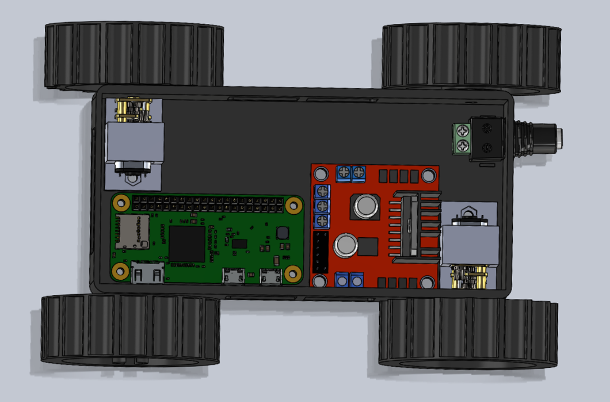
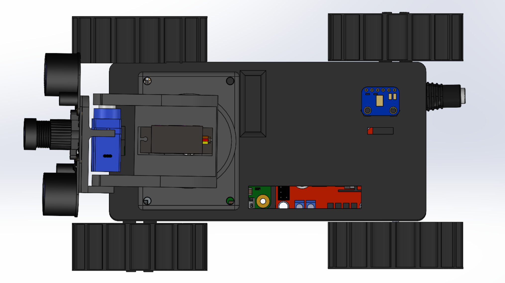
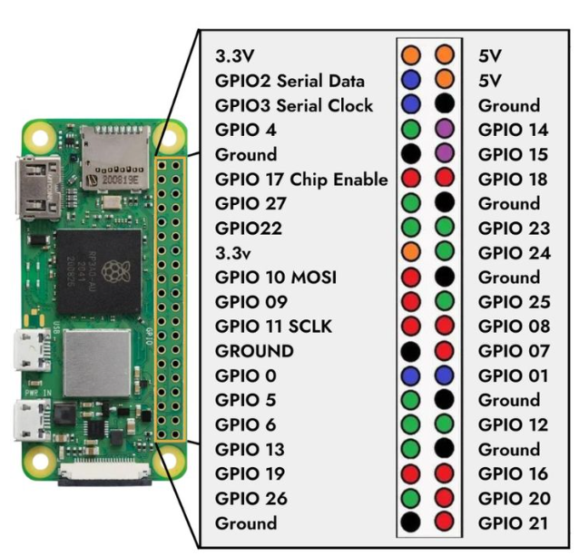

# Hardware Setup

!!! note "Pre-assembled Rover"
    All necessary hardware components are already assembled in the supplied rover.  
    This section is only required if you plan to **modify**, **repair**, or **build your own** version of the robot.  
    The pre-assembled rover included with the kit is **ready to use out of the box**, with no additional mechanical work required.
    
## Preparation
Before assembling the rover for the first time, ensure all components are printed and collected as listed in the Components List.

**3D Print Components List**

| Component             | Qty | Approx. Time/Unit (hh:mm) | Used Filament per Part (g, m) |
|------------------------|-----|---------------------------|--------------------------------|
| Chassis Base           | 1   | 01:38                     | 50.49 g, 16.93 m              |
| Chassis Lid            | 1   | 00:57                     | 31.45 g, 10.55 m              |
| Treads                 | 2   | 02:37                     | 33.71 g, 11.30 m              |
| Unpowered Wheels       | 2   | 00:48                     | 17.47 g, 5.86 m               |
| Powered Wheels         | 2   | 00:44                     | 17.09 g, 5.73 m               |
| Motor Mount            | 2   | 00:17                     | 3.44 g, 1.15 m                |
| Tilt/Pan Camera Mount  | 1   | 01:37                     | 39.45 g, 13.23 m              |

**Total Estimated Print Time:** 13 h 04 min, based on Prusa MK4 with Input Shaper and a 0.4 mm nozzle.

Print duration may vary depending on machine, nozzle size, slicing profile, or material.
All components described were printed in PLA (0.4 mm nozzle).
Other materials may be evaluated; however, they have not been validated.

Safety Notes

- Do not power any electronics during mechanical installation.

- Avoid removing the unpowered wheels after installation, as this may damage the chassis.

- Avoid over-tightening screws to prevent thread or part damage.

- Protect the camera ribbon cable and all electronics from sharp bending or strain.

---

## Chassis Assembly

1. **Install Passive (Unpowered) Wheels**

    - Press the wheel onto the chassis stub.

    - Some force may be required. Rotate the wheel several times to reduce initial friction.

    - The wheel should rotate smoothly.

2. **Install Motor Mounts**

    - Secure each motor mount to the chassis using M3 hex cap screw and nut.

3. **Install Motors**

    - Insert each motor into its mount.

    - Feed the motor spindle through the corresponding chassis opening.

4. **Install Treads and Powered Wheels**

    - Position the treads over the unpowered wheel.

    - Position the powered wheel on the motor spindle and press until fully seated.

    - Repeat on the opposite side.

5. **Important considerations:**

    - The treads must be placed before the powered wheel is fully secured; they will not pass over the powered wheel lip afterward.

    - Wheel fit varies depending on print tolerance. Adjust the spindle bore in future prints to achieve a snug interference fit if required.

    - If adhesive is used, fit the wheel with the treads already in place. Super glue was used during prototyping.

Chassis assembly is now complete.

---

## Camera Pan-Tilt Assembly

1. Secure the pan-tilt base to the lid.

2. Attach the servo horn to the MG90S 9 g servo (pan / rotational stage) and fasten with the supplied screws.

3. Install the middle cam linkage onto the servo horn.

4. Attach the upper camera mount; it should engage in the locating hole and raised cylinder.

5. Install the FS90R servo (tilt stage) into the provided mounting position and fasten with screws.

6. Mount the IR camera module to the top surface, ensuring hole alignment

---

## Electronics Installation

!!! warning "Read the Safety Manual First!"
    Ensure you have reviewed the safety instructions before working with power, wiring, or electronics.  
    This helps prevent damage to components and reduces the risk of electrical hazards.

**Inside Chassis:**

- Install the Raspberry Pi Zero.

- Install the motor driver.
    
- Insert the barrel-jack connector through the rear chassis opening until it clicks into position.

**On Lid:**

- Install the microphone module.

- After wiring is complete, route the camera ribbon through the lid and connect it to the IR camera module.

- Handle the ribbon carefully to prevent creasing or damage.

**Wiring Connections:**

Follow the wiring table below to correctly connect each component to the Raspberry Pi Zero 2W.  

Ensure all connections are secure and correspond to the specified GPIO pins before powering the system.  

Double-check power and ground connections, particularly for the UBEC 5V regulator, to prevent voltage mismatch or damage to sensitive components.  

It is recommended to complete all wiring with the power supply **disconnected** to avoid short circuits during installation.

| Component                               | Component Pin | RPi Zero 2W Pin   | 
|-----------------------------------------|---------------|-------------------|
| **Motor Driver (L298N)**                | 12V           | *N/A* (UBEC)      |              
|                                         | ENA           | GPIO 12 (PWM)     |
|                                         | ENB           | GPIO 13 (PWM)     |
|                                         | IN1           | GPIO 16           |
|                                         | IN2           | GPIO 5            |
|                                         | IN3           | GPIO 6            |
|                                         | IN4           | GPIO 26           |
|                                         | Ground        | GND (UBEC)        |
|                                         |               |                   |
| **Servo Motor (FS90R – full rotation)** | 5V            | *N/A* (UBEC)      |
|                                         | Signal        | GPIO 23           |
|                                         | GND           | GND (UBEC)        |
|                                         |               |                   |
| **Servo Motor (MG90S – 180°)**          | 5V            | *N/A* (UBEC)      |
|                                         | Signal        | GPIO 24           |
|                                         | GND           | GND (UBEC)        |
|                                         |               |                   |
| **Adafruit I2S MEMS (SPH0645LM4H)**     | 3V            | *N/A* (UBEC)      |    
|                                         | LRCL          | GPIO 19 (PCM_FS)  |
|                                         | DOUT          | GPIO 20 (PCM_DIN) |
|                                         | BCLK          | GPIO 18 (PCM_CLK) |
|                                         | GND           | GND (UBEC)        |