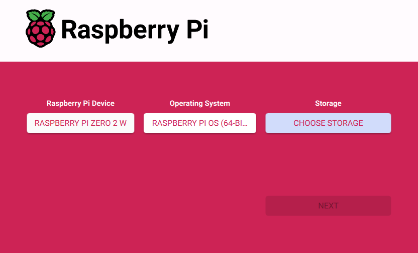

# Onboard Computer Setup
This section covers preparing the onboard Raspberry Pi Zero 2 W before integration with the control system. 

It includes OS installation, SSH configuration, dependency setup (Python, GStreamer), and enabling Wi-Fi connectivity for initial pairing.

--- 

## Step 0 — Using the Pre-Configured RPi and MicroSD Card

If you are using the **pre-configured Raspberry Pi Zero 2 W** and **microSD card** provided with your setup, follow the instructions below to connect it to your network.  
These steps allow you to verify the existing installation without reinstalling the operating system.

**Required Accessories**

- Monitor  
- Mini HDMI → HDMI cable  
- Micro USB → USB adapter  
- Mouse  
- Keyboard  

**Procedure**

1. Connect the monitor, mouse, and keyboard to the Raspberry Pi.  
2. Power on the Raspberry Pi and wait until the desktop screen appears.  
3. From the top-right network icon, select **your mobile hotspot** (hosted by the control laptop) or another available Wi-Fi network.  
4. Enter the Wi-Fi password and verify that the Pi connects successfully.  
5. Once connected, note the device’s **hostname or IP address** — you will need it later when establishing the SSH connection from the control laptop.

**Note:** These steps are only required for the **first-time configuration** of a pre-installed unit.  
After confirming network connectivity, you can disconnect the peripherals and operate the system headlessly via SSH.


!!! note "Using a Pre-Configured Raspberry Pi"
    If you are using the **Raspberry Pi Zero 2 W** that came pre-configured with your setup, you can **skip the remaining steps**.  
    The operating system and required dependencies are already installed.  
    Only continue below if you are setting up a **new or replacement** Raspberry Pi.

--- 

## Step 1 — Prepare the MicroSD Card

Use a microSD card (8 GB minimum, 16 GB recommended).  
Back up any existing data, as the following process will erase all contents.

1. Download and install **Raspberry Pi Imager** from the official website:  
   [https://www.raspberrypi.com/software/](https://www.raspberrypi.com/software/)
2. Insert the microSD card into your computer’s card reader.
3. Open Raspberry Pi Imager and choose:

    - **Device:** *Raspberry Pi Zero 2 W*  
    - **Operating System:** *Raspberry Pi OS (64-bit)*  
    - **Storage:** select your microSD card

    

4. Click the **settings** icon (before pressing “Write”) to pre-configure:

    - **Set hostname:** Any Host Name **(need to remember)**
    - **Enable SSH**
    - **Set username/password:** Any Username and Password **(need to remember)**
    - **Configure Wi-Fi:** your network SSID + password (Your Mobile Hotspot or other Access Point) 

5. Save the settings and click **Write**.  
   Wait until the imager confirms completion.

--- 

## Step 2 — First Boot and Network Check

1. Insert the prepared microSD card into the Raspberry Pi Zero 2 W.  
2. Make sure to start your Mobile Hotspot or other Access Point.
3. Connect the power cable; the green activity LED should blink.  
4. Give the Pi ≈ 1–2 minutes to boot and automatically join the Wi-Fi network.  
5. On your control laptop or server, verify that the Raspberry Pi is connected to the network by locating the device with the hostname you set in Step 1.

--- 

## Step 3 — Fetching Code from GitHub for Onboard Computer

In this step, you will retrieve the project code from GitHub and load it onto the onboard Raspberry Pi.  

There are **two recommended methods**, depending on your setup and network configuration:

1. **Direct Cloning (Recommended)** – Clone the repository directly from GitHub onto the Raspberry Pi via SSH.  
   This method keeps the onboard code version-controlled and makes future updates simple using `git pull`.

2. **Indirect Cloning (Manual Transfer)** – Clone the repository on your control laptop first, then upload (inject) the code into the Raspberry Pi using the `scp` command.  
   This option is useful if the Pi has no internet access or restricted network permissions.

**Option 1 — Direct Cloning on the Raspberry Pi**  *(Recommended)*

This is the most efficient method if your Raspberry Pi has an internet connection.

1. SSH into the Raspberry Pi using your host laptop's CMD.
    ```bash
    ssh <USER>@<HOST_NAME>
    ```
2. Install Git (if not already installed)
    ``` bash
    sudo apt update
    sudo apt install git -y
    ```
3. Navigate to the working directory
    ``` bash
    cd /home/<USER>/
    ```
4. Clone the repository from GitHub  
   Clone the **comms_rpi_dev** branch directly, which contains the latest Raspberry Pi communication scripts:

   ```bash
   git clone -b comms_rpi_dev https://github.com/EriCheww/ECE4191-R15.git
    ```
This will create a new folder /home/pi/ECE4191-R15.
5. Verify the clone
    ``` bash
    ls
    ```
You should see the project folder listed.
To pull future updates:
    ```bash
    cd ~/ECE4191-R15
    git pull
    ```

**Option 2 — Indirect Cloning, Manual Transfer via SCP** 

Use this method if the Raspberry Pi has no internet access or restricted network permissions.

1. On your control laptop, clone the repository locally, using git or GitHub Desktop.
2. Naviagte to the cloned directory.
3. Transfer the folder to the Raspberry Pi using SCP
``` bash 
scp -r . <USER>@<HOST_NAME or IP>:<FILE PATH TO WORKING DIRECTORY ON THE RPI>
# Example: 
scp -r . user@RaspberryPi:/home/pi/ECE4191-R15
```
The -r flag copies everything inside your current folder recursively.

4. Verify the transfer
SSH into the Raspberry Pi and check the folder:
``` bash
ssh user@RaspberryPi
ls /home/pi/ECE4191-R15
```

--- 

## Step 4 — Downloading Dependencies and Libraries 
Once the project code has been cloned onto the Raspberry Pi, the next step is to install all required dependencies and libraries needed for the onboard software to run correctly.  
This includes both **system packages** (such as GStreamer for video streaming) and **Python libraries** (for processing, communication, and control).

| Script | Purpose | System Dependencies | Python Libraries (Require Install) | Python Libraries (Built-in) |
|---------|----------|--------------------|------------------------------------|------------------------------|
| **gs_stream.py** | Streams live H.264 video from the Pi camera over UDP using GStreamer. | `gstreamer1.0-tools`, `gstreamer1.0-plugins-base`, `gstreamer1.0-plugins-good`, `gstreamer1.0-plugins-bad`, `gstreamer1.0-plugins-ugly`, `gstreamer1.0-libav`, `rpicam-apps` | *(None required)* | `subprocess`, `sys`, `signal`, `shutil` |
| **controls_receiver.py** | Receives control packets from the laptop and drives DC/servo motors through GPIO. | `pigpio`, `python3-pigpio`, `pigpiod` daemon (must be running) | `pigpio` | `socket`, `json`, `threading`, `time`, `sys`, `termios`, `tty` |
| **audio_PIClient.py** | Captures microphone audio and streams it to the control laptop via TCP. | `portaudio19-dev` | `sounddevice`, `numpy` | `socket`, `queue`, `struct`, `signal`, `sys` |


**gs_stream.py** — Video Streaming Dependencies
```bash
# Update and upgrade system packages
sudo apt update 
sudo apt upgrade -y

# Install GStreamer and camera utilities
sudo apt install -y gstreamer1.0-tools \
    gstreamer1.0-plugins-base \
    gstreamer1.0-plugins-good \
    gstreamer1.0-plugins-bad \ 
    gstreamer1.0-plugins-ugly \
    gstreamer1.0-libav \
    rpicam-apps
```

**controls_receiver.py** — Motor and Control Dependencies
```bash
# Update package lists
sudo apt update

# Install pigpio and Python bindings
sudo apt install -y pigpio python3-pigpio python3-pip

# Enable and start the pigpiod service (required for GPIO control)
sudo systemctl enable pigpiod
sudo systemctl start pigpiod

# Verify pigpio daemon is active
sudo systemctl status pigpiod
```

**audio_PIClient.py** — Audio Streaming Dependencies
```bash 
# Update package lists
sudo apt update

# Install Python bindings
sudo apt install -y portaudio19-dev python3-pip

# Install Python audio libraries
pip install sounddevice numpy
``` 
--- 

## Step 5 — Editable Code Parameters (Optional)

!!! note "Optional Step — Editing Code Parameters"
    This step is **optional** and provided for reference only.  
    The onboard scripts are pre-configured with default parameters that should work for most setups.  
    You do **not** need to modify these values unless your hardware wiring, network configuration, or streaming requirements differ from the standard setup.

| Script | Parameter | Description | Example / Default Value |
|---------|---------|--------------|--------------------------|
| **gs_stream.py** | `UDP_IP` | IP address of the target (receiver) device — usually your control laptop or server that receives the video stream. | `"192.168.1.10"` |
| | `UDP_PORT` | Port number used for the UDP video stream. Must match the receiver’s GStreamer or GUI configuration. | `5000` |
| | `WIDTH` | Width of the video frame (in pixels). Adjust for resolution vs. performance. | `640` |
| | `HEIGHT` | Height of the video frame (in pixels). | `480` |
| | `FPS` | Frame rate of the video stream. Higher FPS increases bandwidth usage. | `30` |
| **controls_receiver.py** | `UDP_IP` | IP address to bind the UDP socket for receiving control data. Usually set to the Pi’s local IP or `"0.0.0.0"`. | `"0.0.0.0"` |
| | `UDP_PORT` | Port number for incoming control signals from the control laptop or GUI. Must match sender’s configuration. | `5052` |
| | `PWM_PIN_LEFT` / `PWM_PIN_RIGHT` | GPIO pins controlling motor driver PWM signals. Change if your wiring differs. | `12`, `13` |
| | `SERVO_PIN` | GPIO pin for camera servo tilt control. | `18` |
| | `PWM_FREQ` | Frequency (Hz) for motor PWM output — higher frequency reduces audible noise. | `100` |
| **audio_PIClient.py** | `SERVER_IP` | IP address of the audio receiver (usually the control laptop or server). | `"192.168.1.10"` |
| | `SERVER_PORT` | TCP port for audio streaming. Must match receiver settings. | `5051` |
| | `SAMPLE_RATE` | Audio sampling rate in Hz. Common values: `44100` or `48000`. | `44100` |
| | `CHUNK_SIZE` | Number of audio samples per packet — affects latency and CPU load. | `1024` |
| | `CHANNELS` | Number of audio channels (1 = mono, 2 = stereo). | `1` |
