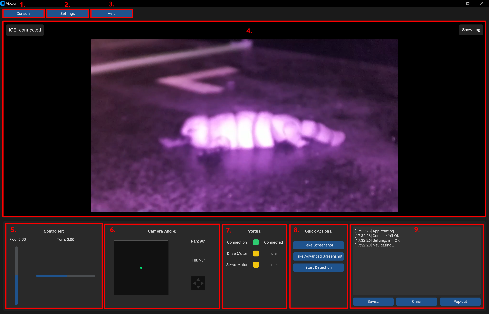
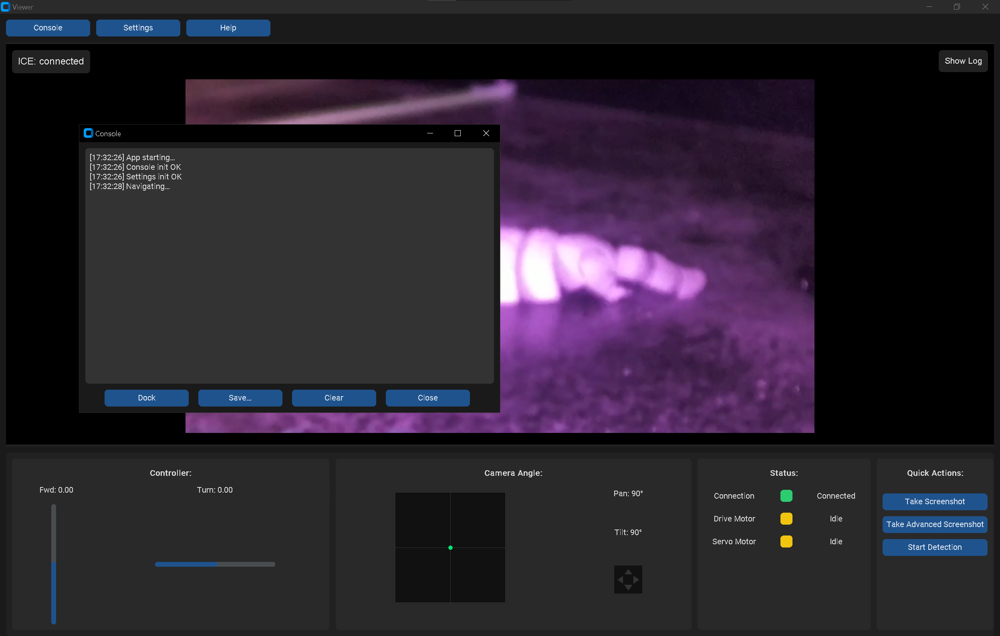
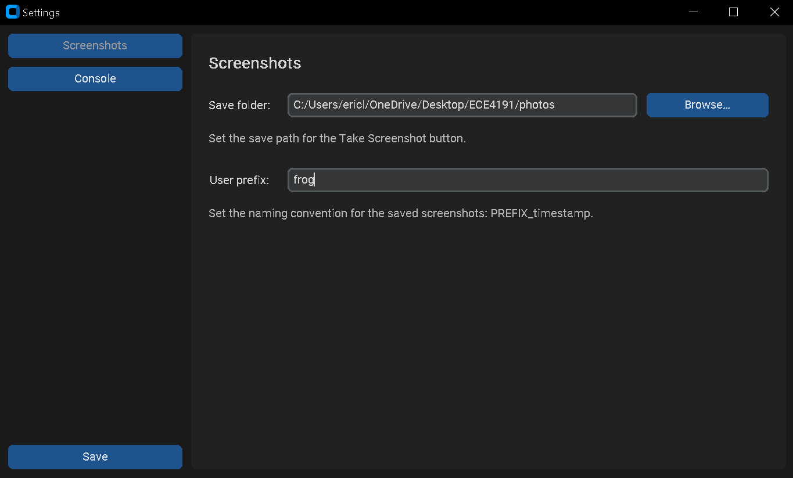
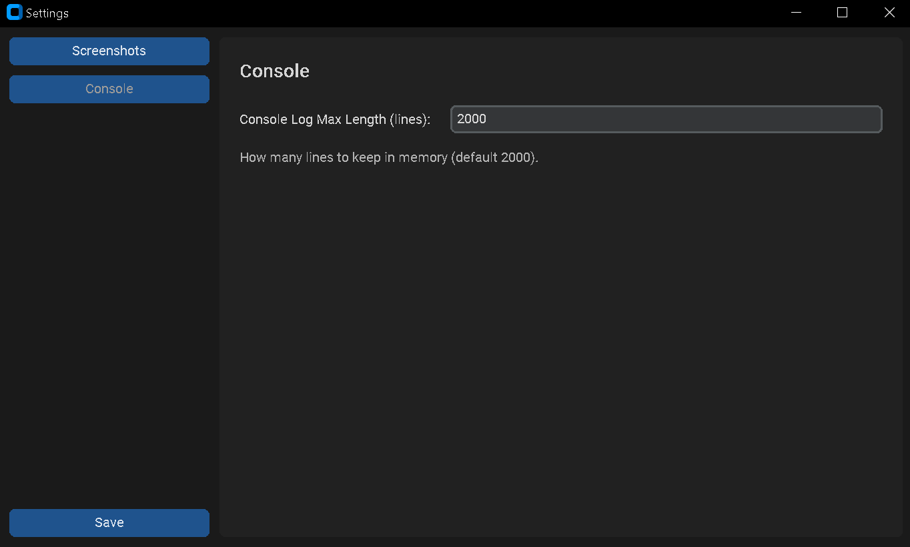
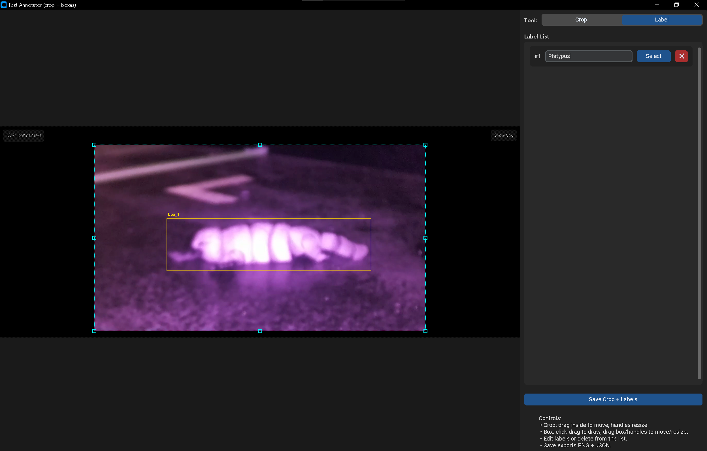
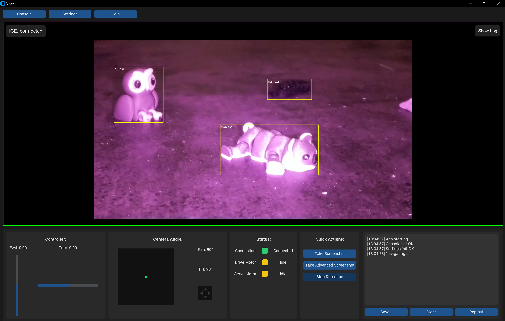

# Operation Manual 

This Operation Manual describes the steps required to run the robot **after the initial setup has been completed**.  
> Before operating, ensure all pre-use and hazard checks are complete - see **Safety Manual → 1 Purpose and Scope** and **3 Identified Hazards and Controls**.

Once the rover has been assembled, configured, and connected to the network for the first time, the procedures in this manual outline the **routine steps you will follow every time you power on and operate the robot**.

The instructions here focus on powering the system, connecting to the control interface, starting the video stream, and driving the rover safely.  

!!! note "Ready to go!" 
    No hardware disassembly, wiring changes, or software reinstallation is required during normal operation.

!!! warning "Read the Safety Manual First"
    Before operating the rover, ensure you have reviewed the **Safety Manual**.  
    It covers important guidelines related to safe handling, motor movement awareness, battery and power usage, and protecting electronics such as the camera ribbon cable.  
    Operating the rover without reviewing safety considerations may result in accidental damage or injury.

## Starting Up
### Step 1 — Establish Connection 
There are multiple connection methods available for operating the rover, as described earlier in this manual.  
These include using a dedicated server, connecting through a WiFi extender or portable router, or using the recommended **mobile hotspot** method.  
While all methods are functional, we recommend using a mobile hotspot for simplicity, portability, and ease of setup.  
The following steps will demonstrate how to establish the connection using the mobile hotspot configuration.

1. **Enable Mobile Hotspot on the Control Laptop**
    - Open your laptop’s network settings and enable *Mobile Hotspot*.
    - If selectable, set the hotspot to **2.4 GHz** (recommended for Raspberry Pi WiFi compatibility).

!!! warning "Do **Not** Change the SSID or Password"
    During the First-Time Setup, you took the SSID and password **directly from your Mobile Hotspot settings** and used those exact values when configuring the Raspberry Pi.
    The Pi is now set to automatically reconnect to **that specific hotspot** every time it starts.
    If you change the SSID or password later, the Raspberry Pi will no longer connect on its own, and you would need to manually reconfigure it using a **keyboard, mouse, and monitor** — which is tedious.

2. **Power On the Rover**
    - Turn on the rover’s power supply.
    - Allow the Raspberry Pi to boot up (approximately 20–30 seconds).

3. **Verify the Connection**
    - The Raspberry Pi is pre-configured to automatically connect to this hotspot.
    - Check your Mobile Hotspot device list. You should see **one connected device** corresponding to the Raspberry Pi.
    - If the Pi appears in the list, the network connection has been successfully established.
> Refer to **Safety Manual → 5 Pre-Operation** for safe connection handling and tether management before powering the system.

---

### Step 2 — SSH into the Raspberry Pi

Once the rover is connected to the mobile hotspot, you can access the Raspberry Pi remotely using **SSH** (Secure Shell).  
This allows you to start running the required scripts on the Raspberry Pi.

SSH works **exactly the same way** as it did during the **First Time Setup**.  
Refer back to the setup instructions here: **[First Time Setup – Onboard](getting_started/first_time_setup/onboard.md)**  

To connect, use the standard SSH format:

```bash
ssh <USER>@<HOST_NAME>
``` 

--- 

### Step 3 — Run All Required Scripts On Raspberry Pi
Once you have successfully connected to the Raspberry Pi over SSH, the next step is to start the control and video streaming services.  

These scripts were already configured during the First Time Setup.
> Ensure all items in **Safety Manual → 6 Pre-Use Safety Checklist** are completed before running any scripts.

1. **Navigate to the project directory**
    ``` bash
    cd /home/<USER>/
    ```

2. **Run Code** 
    ``` bash 
    python gs_stream.py
    ```

3. **Run Next Script**
    - Open a new SSH session (DO NOT CLOSE THE FISRT ONE).
    - Navigate to the project directory.
    - Run the next script.

    ``` bash
    python controls_receiver.py
    ```

4. **Repeat for Last Script**
    - Repeat previous step for 

    ``` bash
    python audio_PIClient.py
    ```

--- 

### Step 4 — Run All Required Scripts on the Control Laptop

Now that all required scripts are running on the Raspberry Pi, the final step is to start the control and viewing interfaces from the control laptop.  
These scripts handle joystick input, camera viewing, WebRTC setup, and status monitoring.

1. **Start the live stream relay**
    - Navigate to the project directory on your laptop.
    - Run the stream relay script:
    ```bash
    python gs_relay_stream.py
    ```

2. **Start GUI**
    - Make sure to connect your controller before running the gui.py script.
    - In another terminal window (leave the relay running), navigate to project directory.
    - Run the GUI scipt: 
    ```bash
    python gui.py
    ```

3. **Start Audio**
    - In another terminal window, navigate to project directory into audio.
    - Run the audio scipt: 
    ```bash
    python LaptopHostClassify.py
    ```

--- 

## Using the GUI

When all scripts are running correctly on both the Raspberry Pi and the control laptop, the GUI should open automatically and display the live video feed from the rover.  

You should also see the motor controls, camera tilt controls, and status indicators available and responsive.

If the GUI does **not** appear, the video feed does not load, or controls are unresponsive, refer to the **[Troubleshooting Manual](troubleshooting.md)**   for guidance on resolving common connection and startup issues.
> If movement becomes unsafe or erratic, immediately activate the **E-Stop** - see **Safety Manual → 5 Standard Operating Procedure (Operation)** and **7 Emergency Procedures**.


### GUI Layout


1. **Console Button**  
    This button toggles the system console between being **embedded inside the GUI** (where label 9 is) and opening as a **separate external window**.  
    Use the embedded view for a cleaner, compact interface, or switch to the external window when you need more space to monitor logs, status messages, or debugging output.

    

2. **Settings Button** 
    This button opens the **Settings** window.  
    This window allows you to adjust Console Settings and Screenshot Settings.

    
    

3. **Help Button** 
    This button takes the operator to this User Manual for quick access.

4. **Live Video Feed**
    This is the main dispaly for the live video feed from the rover. 

5. **Controller Movement Indicator**
    This panel displays the current motor output levels, allowing the operator to visually monitor the rover’s driving speed and direction.  
    It provides real-time feedback so the operator can accurately gauge how fast the rover is moving.

6. **Camera Angle Indicator**  
    This panel shows the current camera orientation relative to the front of the rover.  
    The **green dot** represents the direction the camera is currently facing, allowing the operator to easily understand the camera’s pan/tilt position during operation.

7. **Status Indicator**  
    This panel displays the current status of the network connection, drive motors, and servo motors.  
    It allows the operator to quickly verify that the rover is receiving control commands and responding correctly.

8. **Quick Actions**  
    This panel contains a set of quick-access control buttons.  
    Each button performs a specific predefined action, which will be explained in detail in the following section.

9. **Console Embedded Position**  
   This is the area where the console appears when it is embedded within the GUI.  
   It allows the operator to view real-time log messages and system output while driving the rover, and also provides the option to save logs if needed.

---

### Quick Actions
#### Take Screenshot
Captures the current live video frame (from the video panel in label 4) and saves it to the configured **output folder** using the **filename prefix** specified in the Settings menu.  

If **detection mode is active**, any detection overlays (such as bounding boxes or labels) will also be included in the screenshot.  
This is useful for recording observations, documenting test runs, collecting dataset images, or saving visual evidence of detected targets.

<br>

#### Take Advanced Screenshot
Opens a dedicated screenshot editor window that captures the current video frame (from label 4), just like the standard *Take Screenshot* feature.  

However, this tool additionally allows the operator to **draw and adjust bounding boxes**, **label objects**, and **optionally crop the image**.  

When saving, both the **image** and the corresponding **bounding box annotation file (.json)** are stored together, making the output immediately ready for **YOLOv8 training** or dataset creation workflows.



<br>

#### Start Detection
Enables the AI-based animal detection system.  

When activated, the live video feed (from label 4) is continuously analysed in real time, and any detected animals are highlighted with bounding boxes and labels.  

This allows the operator to visually confirm detections directly within the GUI while the rover is in operation.



> Full emergency responses and safe-stop logic are detailed in **Safety Manual → 7 Emergency Procedures**.
>
> ---

## Cross-Reference Summary (Operator ↔ Safety Manual)

| **Topic** | **Operator Manual Section** | **Safety Manual Reference** |
|------------|-----------------------------|------------------------------|
| Power On Sequence | Starting Up → Step 2 - Power On the Rover | 2 System Overview · 3 Electrical Hazards |
| Network Setup | Starting Up → Step 1 - Establish Connection | 5 Pre-Operation |
| GUI Operation | Using the GUI | §5 (Operation) · 6 Checklist |
| E-Stop / Emergency | Quick Actions | §5 (Operation) · 7 Emergency Procedures |
| Operator Training | Read the Safety Manual First | 8 Training and Authorisation |

